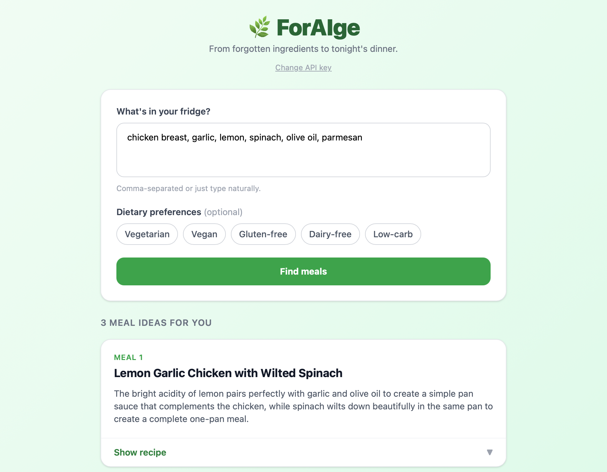

# 🌿 ForAIge

**From forgotten ingredients to tonight's dinner.**

ForAIge turns whatever's left in your fridge into a real meal plan. Type in your ingredients, pick any dietary preferences, and Claude suggests three meals you can actually make — each with a recipe.

No account. No backend. No wasted food.

---

## Screenshot



---

## How to run locally

**Prerequisites:** Node.js 18+ and an [Anthropic API key](https://console.anthropic.com/).

```bash
git clone https://github.com/KlaytonHutchins/forAIge.git
cd forAIge
npm install
npm run dev
```

Open [http://localhost:5173](http://localhost:5173) in your browser. On first load you'll be prompted to enter your Anthropic API key — it's saved in `localStorage` so you only need to do this once.

---

## How it works

1. You type in whatever ingredients you have on hand (free-form or comma-separated)
2. Optionally toggle dietary preferences like vegetarian or gluten-free
3. ForAIge sends your ingredients to Claude, which returns exactly 3 meal suggestions as structured JSON
4. Each meal shows a name, why it works with your ingredients, and a step-by-step recipe

---

## Tech stack

| Layer | Choice |
|---|---|
| Framework | React 19 + TypeScript |
| Build tool | Vite |
| Styling | Tailwind CSS v4 |
| AI | Anthropic Claude API (`claude-sonnet-4-6`) |
| Deployment | Vercel / GitHub Pages |

---

## API key & privacy

Your Anthropic API key is stored exclusively in your browser's `localStorage`. It is never sent to any server other than `api.anthropic.com` directly from your browser. There is no backend, no database, and no logging.

---

## Hackathon

Built for the **Learning Hackathon: Spec Driven Development** on [Devpost](https://devpost.com/). The focus of this hackathon is the planning and spec process — see the `docs/` folder for the scope doc, PRD, technical spec, and build checklist.

---

## License

MIT
